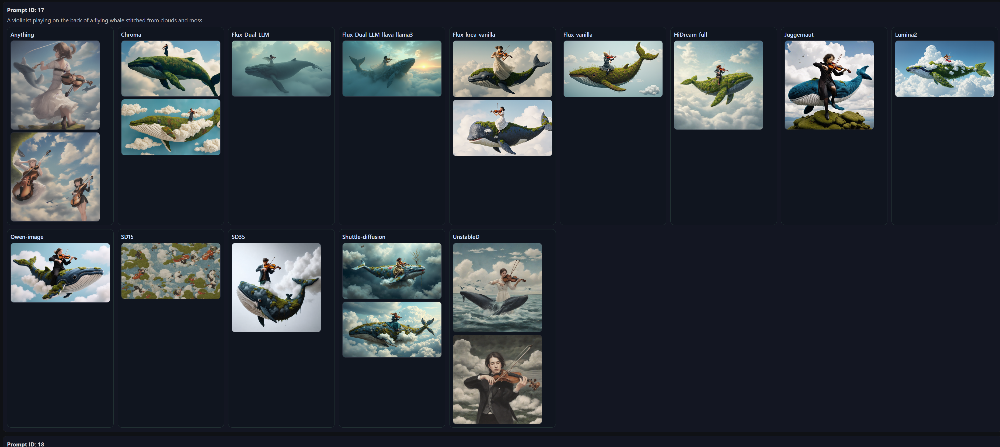

----- Prompt Comparison Viewer -----

I made this to see how different models respond to a standard set of prompts. 
Each prompt produces a grid of images, showing how different models interpret the same text.

There are general prompts, some surreal and horror prompts, and some that test text and
ability to closely conform to the prompt.

The included dataset contains ~2000 images for 14 models and 141 prompts.

## Example Output

Prompt #17: A violinist playing on the back of a flying whale stitched from clouds and moss.

## Contents

- `model_sample_images/` — ~2100+ PNGs generated across different models.  
- `viewer2.html` — An interactive viewer for browsing prompts and outputs.  
- `db.sqlite` — SQLite database mapping prompt IDs, text prompts, and image files.  

---

## Usage

1. Clone the repo:
   git clone https://github.com/Mistercat/Sample-Images.git
   cd Sample-Images
Open viewer2.html in a browser to explore the dataset.
At the top of the page select the db file and then the image folder.
Prompts are displayed alongside the generated outputs for each model.

Query the database (yakudb.sqlite) to search/filter prompts and outputs:

sql
Copy
Edit
SELECT prompt_text, model_name, image_file
FROM generations
WHERE prompt_id = 17;

Why This Dataset?
Prompt diversity: Covers a wide range of themes and instructions (realism, surrealism, composition tests).

Model comparison: Side-by-side outputs make strengths and weaknesses obvious.

Benchmarking: Useful for testing prompt adherence and model behavior regressions.

Creative gallery: Also just fun to browse — many generations are striking on their own.

